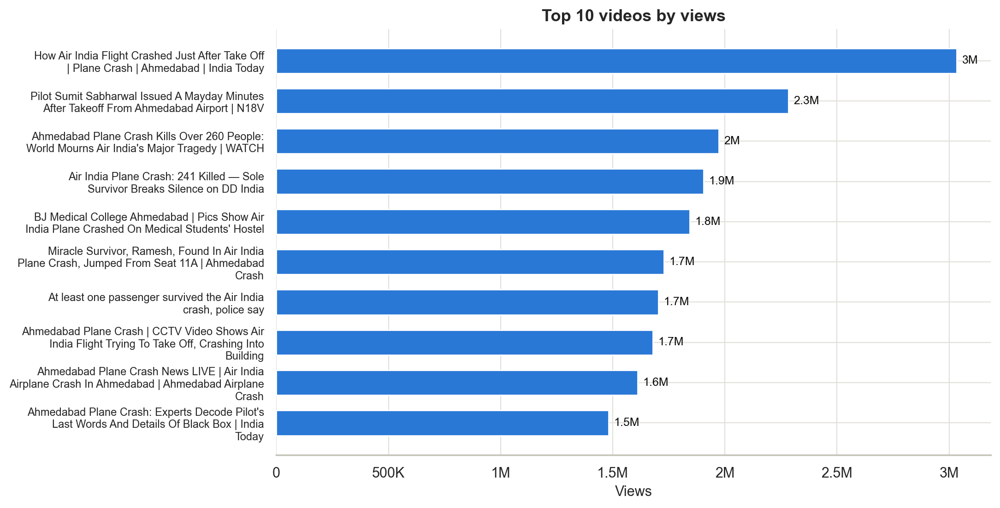
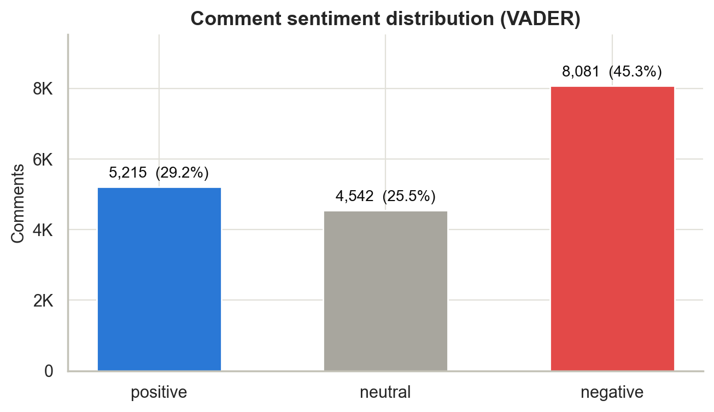
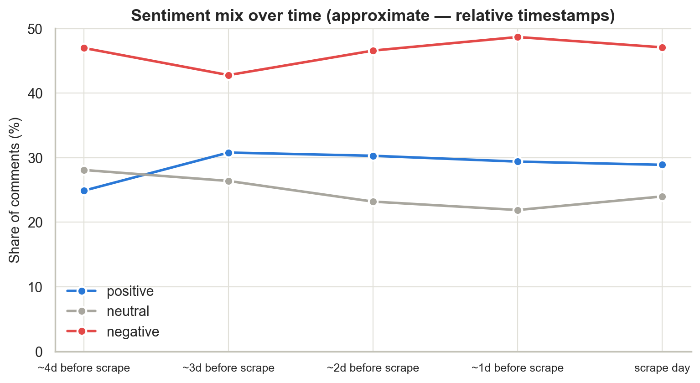
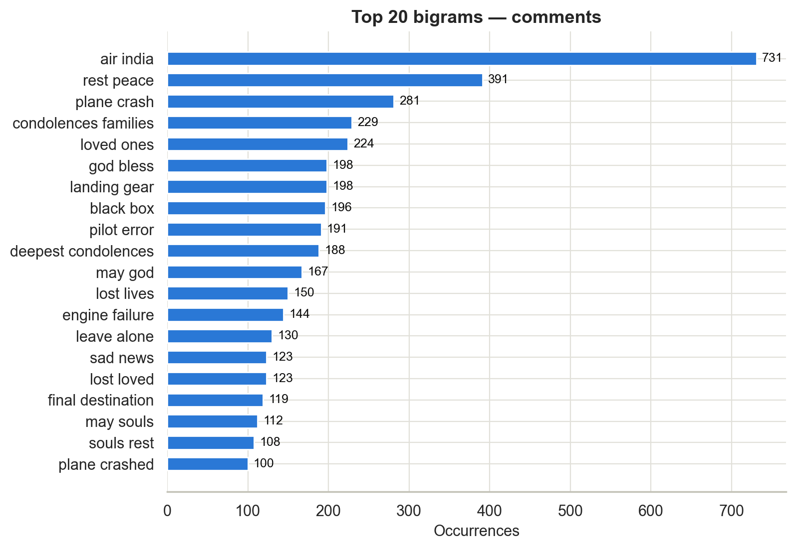

# Air India Ahmedabad Crash: YouTube Media Coverage, Engagement, and Public Sentiment Analysis

End-to-end data-analyst project on the Kaggle dataset **["Air India Ahmedabad Crash: YouTube Video Dataset"](https://www.kaggle.com/datasets/lucaspimeentel/air-india-ahmedabad-crash-youtube-video-dataset)** — Python, SQL (SQLite), VADER sentiment analysis, and a BI-ready dashboard layer.

**▶ [Live interactive dashboard](https://meghanakoduru.github.io/air-india-youtube-analytics/)** — KPIs, channel/theme filters, sentiment trend, keywords, and key takeaways (GitHub Pages, no install).

> **Scope & ethics.** This project analyzes *media coverage and audience language* around the 12 June 2025 crash of Air India flight AI171. It draws **no conclusions about the cause of the crash**, and sentiment scores measure the tone of comment language — not factual accuracy and not public verdicts about culpability. See [Ethical considerations](#limitations--ethical-considerations).

## Project overview

When a major news event breaks, media teams need to understand which outlets and framings capture attention and how audiences respond. Using 93 YouTube news videos (42 channels, 45.0M combined views) and 17,838 scraped comments, this project answers: How was coverage distributed? Which videos and channels won attention? What did audiences talk about, and in what tone?

## Business problem

A media-analytics team wants evidence-based answers to: coverage concentration across outlets, the framings that drive views, the structure and tone of audience discussion, and the data gaps that must be fixed before generalizing.

## Dataset

Two Excel files (scraped 2025-06-16, embedded in the filenames):

| File | Rows | Contents |
|---|---|---|
| `... - video details.xlsx` | 94 | videoId, title, lengthSeconds, keywords, shortDescription, allowRatings, viewCount, author, isPrivate |
| `... - comments.xlsx` | 17,964 | commentId, content, publishedTime (relative), replyLevel, author handle, video_id, like count, replyCount |

**Discovered constraints that shape the whole analysis** (verified in code, not assumed): the video table has **no likes, comment counts, publish dates, or subscriber counts**; all comments belong to **a single Firstpost video**; timestamps are relative labels ("3 days ago"). Every dependent analysis is skipped gracefully and logged, with honest substitutes where they exist.

## Objectives

1. Coverage over time → *skipped (no publish dates); comment-volume-by-day used as the available time signal*
2. Highest-viewed videos ✔
3. Channel viewership & engagement → *views ✔; engagement not computable*
4. Engagement-rate rankings → *skipped; documented views-per-minute proxy*
5. Views/likes/comments relationships → *correlation run on available metrics (views, duration, text features)*
6. Engagement over time → *comment engagement by day ✔*
7. Common topics in titles/descriptions/comments ✔ (keywords, bigrams, word cloud)
8. Overall public sentiment ✔ (VADER)
9. Sentiment over time ✔ (approximate day buckets)
10. Actionable insights ✔ (`outputs/insights/business_insights.md`)

## Technology stack

Python 3.9 · pandas · NumPy · Matplotlib · Seaborn · vaderSentiment · WordCloud · SQLite (stdlib `sqlite3`) · Jupyter (nbformat/nbclient) · openpyxl

## Pipeline

**Phase 1 — Cleaning** (`src/data_cleaning.py`): auto-detects files, standardizes column names, maps raw columns → logical fields via candidate lists (no hard-coded schema), removes duplicates (1 duplicate video row; 95 duplicate + 31 empty comments), parses K/M/B-suffixed numerics with a reusable `clean_numeric()`, resolves relative timestamps against the scrape date, cleans text while preserving emoji (VADER scores them). Missing-value strategy: unknown numerics stay NaN, hidden like-counts fill 0, text fills "". Summary: `outputs/tables/data_quality_summary.csv`.

**Phase 2 — Features** (`src/data_analysis.py`): engagement metrics *where sources exist* (guarded, skipped here), title/description lengths, tag counts, descriptive theme flags (`mentions_boeing`, `mentions_survivor`, `is_live_or_breaking`), comment length and day buckets.

**Phase 3 — EDA**: KPIs, top-10 rankings, channel aggregates, correlation matrix, distributions (log scales for skewed view counts).

**Phase 4 — Sentiment** (`src/sentiment_analysis.py`): VADER with standard thresholds (±0.05 on compound); per-class summaries, day trend, most-liked comments per class. Output: `data/processed/comment_sentiment_data.csv`.

**Phase 5 — Text**: stop-word-filtered keywords and bigrams per source, word cloud (fixed `random_state=42`).

**Phase 6 — Charts**: 15 PNGs in `outputs/charts/` (200 dpi, K/M-formatted, horizontal bars for long titles, fixed sentiment colors).

**Phase 7 — SQL**: `air_india_youtube.db` with `videos`, `comments`, `sentiment_results`; schema in `sql/create_database.sql`; 15 documented business queries (CTEs, window functions, CASE) in `sql/business_analysis.sql` — every query verified to execute.

**Phase 8 — Dashboard**: BI-ready CSVs + Tableau/Power BI build instructions in `dashboard/`, **plus a self-contained interactive HTML dashboard** — [`dashboard/dashboard.html`](dashboard/dashboard.html). Open it in any browser (no server, no dependencies — data is inlined): KPI cards, channel/theme filters with click-to-filter channel bars, a comments-vs-likes sentiment toggle, sentiment trend with hover tooltips, keyword/bigram tabs, most-liked comments per class, key takeaways, and light/dark themes.

## Key findings

1. Top 5 of 42 channels captured **52.2%** of 45.0M views; India Today published **22.6% of all videos** (21/93) for 10.8M views.
2. **Survivor/human-story framings led**: 19/93 titles mention the survivor; 4 of the top 10 videos by views center survivor/victims.
3. Comment tone is **sombre, not hostile**: 45.3% negative / 29.2% positive / 25.5% neutral — but top bigrams are *rest peace*, *condolences families*, *loved ones*: grief vocabulary that VADER scores negative.
4. **Positive comments earn the most likes per comment** (11.0 vs 9.0 negative, 5.4 neutral).
5. Sentiment was **stable across the five scraped days** (negative share 42.8–48.7%).

Full analysis: [`outputs/insights/business_insights.md`](outputs/insights/business_insights.md).

## Project structure

```
AirIndia_YouTube_Analytics/
├── data/
│   ├── raw/                      # original Kaggle xlsx files
│   └── processed/                # cleaned_youtube_data / video_analysis_data / comment_sentiment_data
├── notebooks/
│   └── air_india_youtube_analysis.ipynb   # executed, outputs embedded
├── src/
│   ├── data_cleaning.py          # Phase 1
│   ├── data_analysis.py          # Phases 2–3, 5
│   ├── sentiment_analysis.py     # Phase 4
│   ├── visualization.py          # Phase 6
│   └── run_pipeline.py           # one-command end-to-end runner
├── sql/
│   ├── create_database.sql
│   └── business_analysis.sql
├── dashboard/
│   ├── dashboard.html            # self-contained interactive dashboard (open in a browser)
│   ├── dashboard_data.csv        # video grain
│   ├── dashboard_comments_data.csv  # comment grain
│   └── dashboard_requirements.md
├── outputs/
│   ├── charts/                   # 15 PNGs
│   ├── tables/                   # 10 CSV result tables
│   └── insights/business_insights.md
├── air_india_youtube.db          # SQLite (generated)
├── README.md · requirements.txt · .gitignore
```

## Installation & how to run

```bash
pip install -r requirements.txt

# Raw data (not committed): download the two .xlsx files from the Kaggle
# dataset page linked above and place them in data/raw/

# Interactive dashboard — no install needed:
open dashboard/dashboard.html

# Full pipeline (cleaning → EDA → sentiment → charts → SQLite → dashboard exports):
python3 src/run_pipeline.py

# Or interactively:
jupyter notebook notebooks/air_india_youtube_analysis.ipynb

# SQL layer:
sqlite3 air_india_youtube.db < sql/business_analysis.sql
```

The runner prints the detected schema, cleaned shapes, KPIs, the skip log, and verifies every output file exists.

## Limitations & ethical considerations

- **Single-video comment sample** — sentiment shares describe one Firstpost comment thread, not all crash coverage.
- **Missing video metrics** (likes, comment counts, publish dates, subscribers) — engagement-rate and time-of-upload analyses are impossible with this data and are explicitly skipped, never imputed.
- **Approximate dates** — relative labels resolved against 2025-06-16, ±1 day.
- **VADER is English-tuned** — Hinglish/Devanagari comments skew neutral; sarcasm and mourning idiom are imperfectly captured.
- This project concerns a real tragedy. Negative sentiment predominantly encodes grief and must never be reported as verdicts about the crash's cause — that determination belongs to the official investigation. Commenter handles are public display names; quoted comments are used sparingly.

## Screenshots

| | |
|---|---|
|  |  |
|  |  |

## Future improvements

- Scrape comments for all 94 videos to make sentiment representative; add per-video like/comment counts and publish dates via the YouTube Data API.
- Multilingual sentiment (e.g., a transformer model covering Hindi/Hinglish) benchmarked against VADER.
- Topic modeling (BERTopic/LDA) instead of keyword buckets; reply-thread network analysis.
- Publish the dashboard as an interactive web app fed by `dashboard/*.csv`.
